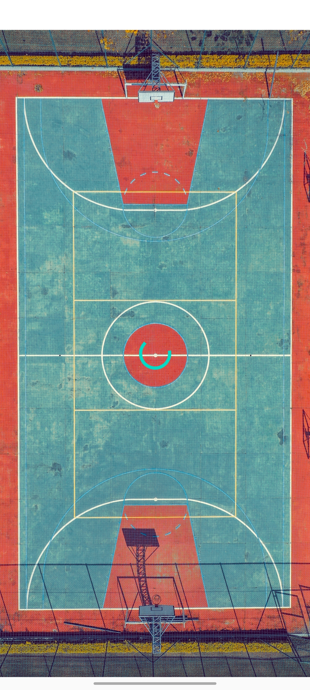
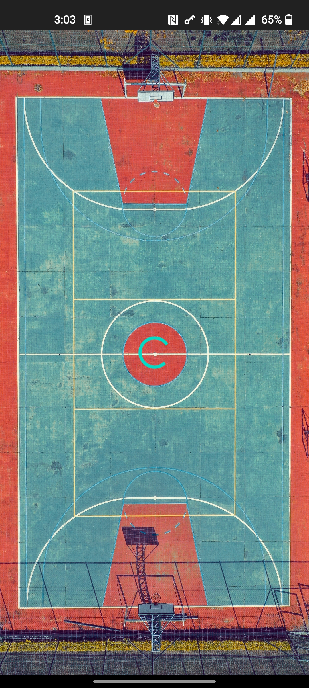
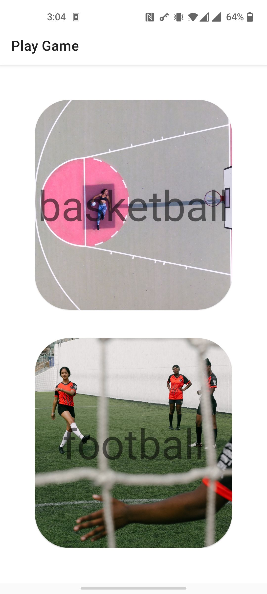
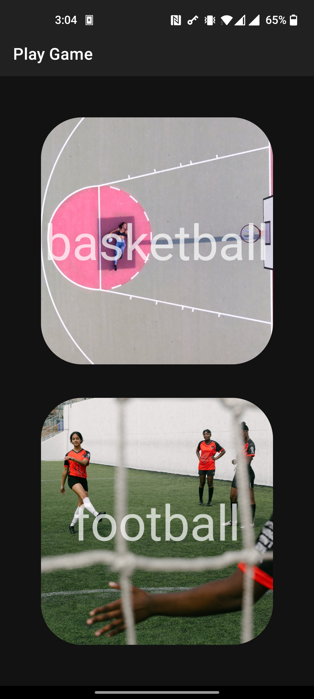
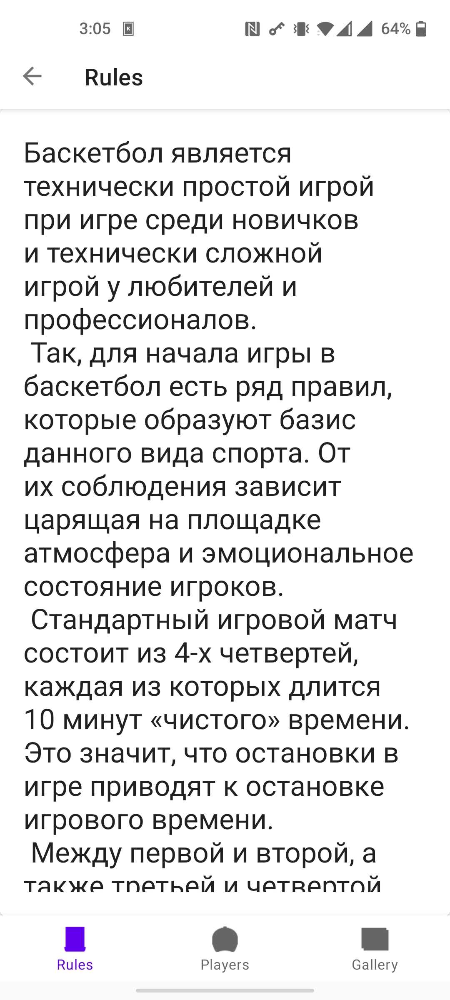
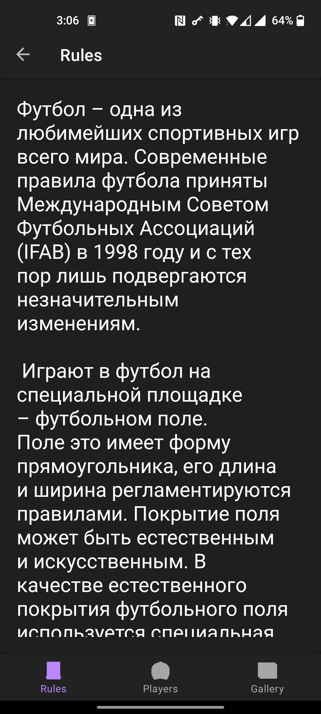
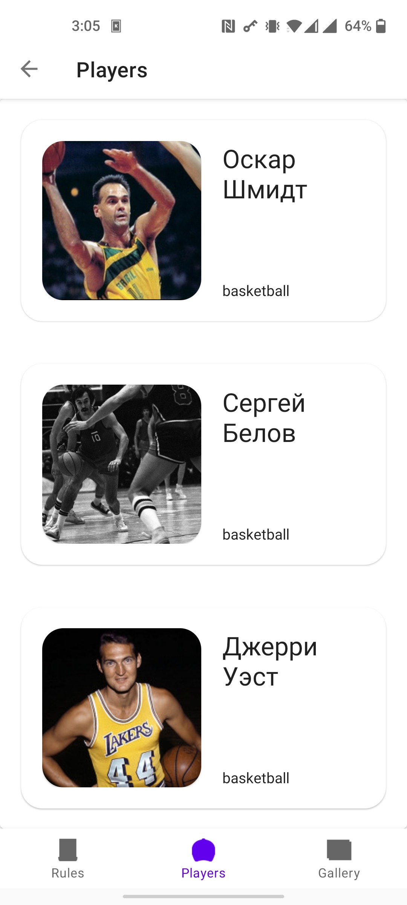
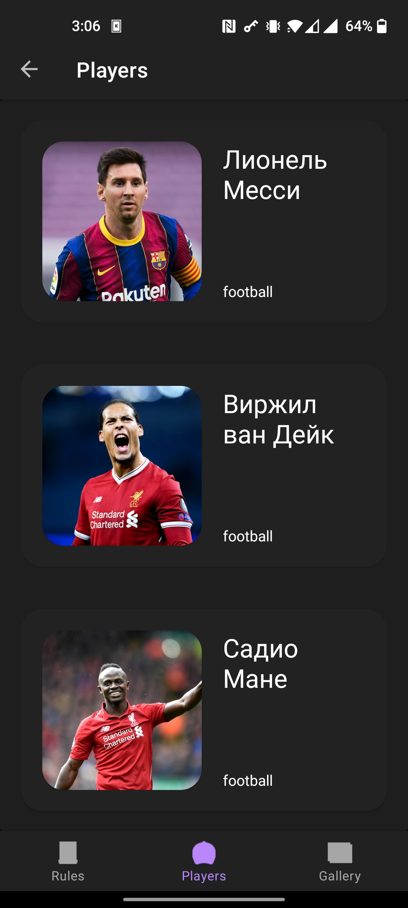
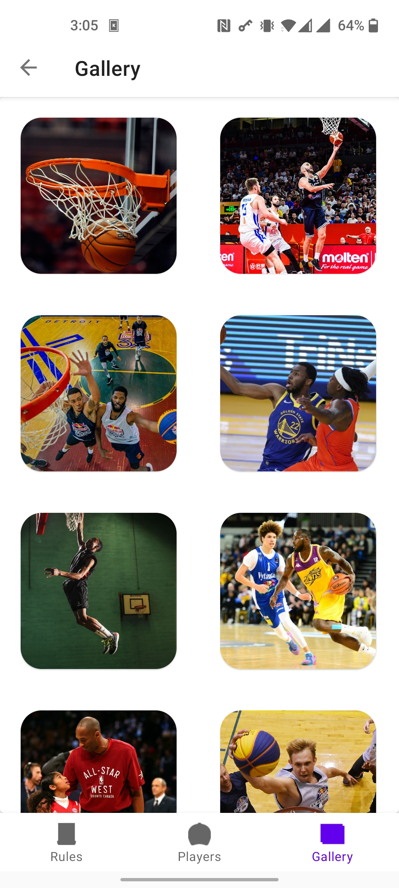
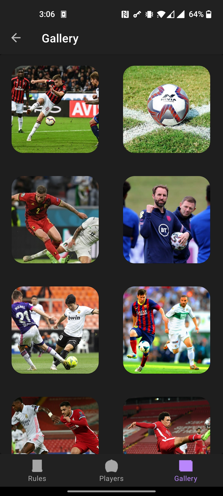

# TestApplicationSport

## Table of Contents

- [Description](#description)
- [Tools](#tools)
- [Installation](#installation)
- [Screenshots](#screenshots)

### Description

Test application with some interesting content but nothing more 

### Tools

- Navigation component (Jetpack's navigation)
- Bottom navigation bar
- Shared element transition (Motion design)
- Glide

### Installation
You can use [release](https://github.com/Slex93/TestApplicationSport/releases) 

### Screenshots

#### Splash screen
 

#### Menu screen
 

#### Rules screen
 

#### Players screen
 

#### Gallery screen
 
